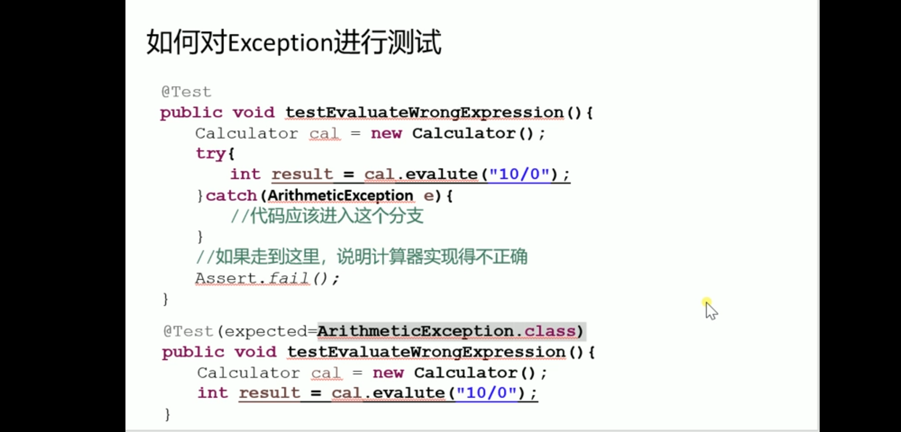

刘欣  码农翻身
# 从零开始造Spring(3.2.18)

## 单元测试

**白盒测试**: 开发人员知道程序的代码逻辑[单元测试是白盒测试]

**黑盒测试**: 只知道接口,输入输出,不知道内部结构

**测试框架**: JUnit


`````java
／／对Calculator类的evalute(String string)方法进行测试
／／测试用例的名字一般在测试类后面加Test作为测试类名
`````

````java
public class CalculatorTest{
    @Test
    public void testEvaluate1(){
        Calculator cal = new Calculator();
        int result = cal.evalute("10+20-5");
        Assert.assertEquals(25, result);//期待值:25 ,实际值:result
    }
    
    @Test
    public void testEvaluate2(){
        Calculator cal = new Calculator();
        int result = cal.evalute("(20-1)*5+6/3");
        Assert.assertEquals(52, result);
    }
}
````

>  如果有很多测试用例,总不能一个个手动运行吧, 这就需要一个一次运行N个测试代码的套件: **Suite**


JUnit**断言**


对自己编写的**Exception**进行测试




@Before和@After

setUp()和tearDown()方法名称随便起, 这个名字是JUnit3内部的起名


@BeforeClass和@AfterClass

方法只执行一次


### 单元测试的作用

1. 验证代码
2. 设计代码时考虑可测试性
3. 单元测试是一种精确的文档

> 单元测试是一个团队行为,要互相验证


### 单元测试的原则

1. 测试代码就是代码的一部分,修改代码也要修改测试用例
2. 测试结果不能影响其他测试用例
3. 单元测试不能依赖时间和环境变化(测试在任何人机器都可以执行)
4. 保证测试的简单和可读
5. 面向接口测试
6. 测试要迅速执行(使用Mock对象对数据库和网络的依赖解耦)
7. 自动化测试用例


### Mock对象


##### easy mock


重构遗留代码


**单元测试运行间隔**

 - 一分钟运行一次自己的测试代码
 - 十分钟运行一次别人的测试用例
 - 一小时运行一次项目的测试用例

**使用code coverage(代码覆盖范围)工具**检查测试用例的对代码的覆盖范围

绿色被测试覆盖的代码, 红色未被覆盖


## TDD(Test-Driven Development:测试驱动开发)


### IoC : 控制反转(DI:依赖注入)


### AOP: 切面编程(Spring AOP 是运行时生成(CGLib和JDK)代理类, Aspect J 是编译期生成代理类) 

代码业务之间是正交的, 像 X轴和 Y轴


### 先写测试, 在写代码


